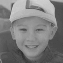

# Shackled-Dancing
A Bit-Locked Diffusion Algorithm for Lossless and Controllable Image Steganography
<a href="https://arxiv.org/abs/2505.10950" style="background-color: red; color: white; padding: 2px 5px; border-radius: 3px; text-decoration: none;">arXiv: 2505.10950</a>
<a href="https://github.com/yingtian22/Shackled-Dancing" style="background-color: #007bff; color: white; padding: 2px 5px; border-radius: 3px; text-decoration: none;">Project Page</a>
## Brief

## Results

<figure>
  <table>
    <tr>
      <td></td>
      <td></td>
      <td></td>
      <td></td>
      <td></td>
      <td></td>
    </tr>
    <tr>
      <td></td>
      <td></td>
      <td></td>
      <td></td>
      <td></td>
      <td></td>
    </tr>
    <tr>
      <td></td>
      <td></td>
      <td></td>
      <td></td>
      <td></td>
      <td></td>
    </tr>
    <tr>
      <td></td>
      <td></td>
      <td></td>
      <td></td>
      <td></td>
      <td></td>
    </tr>
  </table>
  <figcaption>Partial steganographic embedding results. Each row contains five carrier images followed by one hidden image (rightmost).</figcaption>
</figure>

## Acknowledgement
Our code is built on [Image-Super-Resolution-via-Iterative-Refinement](https://github.com/Janspiry/Image-Super-Resolution-via-Iterative-Refinement). We gratefully appreciate their open source contribution!
